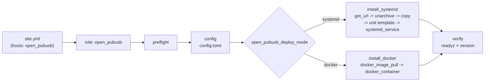

# open-pubusb Ansible デプロイ

> English: [README.md](README.md)

## 目次

- [概要](#概要)
- [前提条件](#前提条件)
- [ディレクトリ構成](#ディレクトリ構成)
- [実行方法](#実行方法)
- [公開変数](#公開変数)
- [タグ](#タグ)
- [冪等性・再起動の約束](#冪等性再起動の約束)
- [検証（verify）](#検証verify)
- [ロールテスト（molecule）](#ロールテストmolecule)
- [持続化についての注記](#持続化についての注記)

## 概要

`open-pubusb`（Google Cloud Pub/Sub v1 互換のローカルサーバー）を、`systemd` サービスまたは
Docker コンテナとしてデプロイする Ansible ロール `open_pubusb` と、そのエントリポイント
`site.yml` を提供する。公開変数と既定値は
`roles/open_pubusb/defaults/main.yml` で定義する。



## 前提条件

| 対象 | 前提 |
|---|---|
| コントロールノード | ansible-core ≥ 2.16（Python ≥ 3.10）。`ansible-galaxy collection install -r requirements.yml` 実行済み |
| 対象ホスト（systemd） | Linux x86_64 / aarch64、systemd 245+、`become` 可能、GitHub Releases へ HTTPS 到達可（またはローカルミラー URL を `open_pubusb_release_base_url` に指定） |
| 対象ホスト（docker） | Docker Engine 稼働、Python Docker SDK（`community.docker` の要件）、GHCR へ到達可 |
| 対象ホスト（localhost） | `ansible_connection: local` でも同じロールが動く |

## ディレクトリ構成

```text
ansible/
├── ansible.cfg
├── requirements.yml
├── site.yml
├── inventory/
│   ├── hosts.yml
│   └── host_vars/<host>/vars.yml
├── group_vars/all.yml
└── roles/open_pubusb/
    ├── defaults/main.yml
    ├── vars/main.yml
    ├── tasks/{main,preflight,config,install_systemd,install_docker,docker_container,verify}.yml
    ├── templates/{config.toml.j2,open-pubusb.service.j2}
    ├── handlers/main.yml
    ├── meta/main.yml
    └── molecule/{default,docker}/{molecule.yml,converge.yml,verify.yml} (+ docker/cleanup.yml)
```

## 実行方法

```bash
cd ansible
ansible-galaxy collection install -r requirements.yml
ansible-playbook -i inventory/hosts.yml site.yml -e open_pubusb_deploy_mode=systemd
ansible-playbook -i inventory/hosts.yml site.yml -e open_pubusb_deploy_mode=docker
```

構文チェック・ドライラン:

```bash
ansible-playbook -i inventory/hosts.yml site.yml --syntax-check
ansible-playbook -i inventory/hosts.yml site.yml --check --diff -e open_pubusb_deploy_mode=docker
```

静的解析:

```bash
ansible-lint ansible/
yamllint ansible/
```

## 公開変数

すべての公開変数（既定値・説明）は
`roles/open_pubusb/defaults/main.yml` を正とする。上書きは
`group_vars/`・`inventory/host_vars/<host>/vars.yml`・`-e` のいずれか。

## タグ

| タグ | 内容 |
|---|---|
| `preflight` | 変数検証・OS/arch 判定・必要パッケージ（docker 方式では Docker 稼働確認） |
| `install` | バイナリ取得・配置（systemd）／イメージ pull（docker） |
| `configure` | `config.toml`・ユニットファイル生成 |
| `service` | 有効化・起動・コンテナ作成 |
| `verify` | readyz 待機・バージョン確認 |

```bash
ansible-playbook -i inventory/hosts.yml site.yml --tags configure -e open_pubusb_deploy_mode=systemd
```

## 冪等性・再起動の約束

- 2 回目以降の実行は `changed=0`（バージョン・設定変更なしの場合）。
- 再起動が起きる条件は「`config.toml` またはユニットファイルが変わった」「バイナリ／
  イメージタグが変わった」のみ。`handlers` 経由（systemd: `Restart open-pubusb`、docker:
  `Recreate open-pubusb container`）で行う。
- Docker コンテナは `community.docker.docker_container` に全オプションを明示し、
  `comparisons: {image: strict, env: strict, '*': ignore}` で不要な再作成を避ける。
  `config.toml` はビンドマウントのため内容変更を `docker_container` 自身は検知できず、
  `handlers/main.yml` の `Recreate open-pubusb container` が `recreate: true` で強制再作成する。
- データディレクトリはロールが削除しない（`state: absent` の掃除タスクは提供しない）。

## 検証（verify）

1. `ansible.builtin.uri` で `http://<bind>:<admin_port>/readyz` が 200 になるまで待機
   （最大 30 回・2 秒間隔）。
2. `open-pubusb version`（systemd）／`docker exec <container> open-pubusb version`（docker）の出力が
   `open_pubusb_version` を含むことを `assert`。

`open_pubusb_verify: false` で検証タスクをスキップできる。

## ロールテスト（molecule）

```bash
cd roles/open_pubusb
molecule test                # デフォルトシナリオ（systemd, geerlingguy/docker-ubuntu2404-ansible）
molecule test -s docker       # docker シナリオ（ホストの Docker ソケットをバインドマウント）
```

`molecule/default` は systemd モードを、`molecule/docker` は docker モード（DinD ソケット
マウント）を converge・冪等性・verify で検証する。CI では `main` へのプッシュ時にのみ実行
する（PR では `ansible-lint` / `yamllint` / `--check --diff` のみ）。

既定では両シナリオとも本番と同じもの（GitHub Releases のリリース tarball と GHCR のイメージ）を
インストールする。未リリースのビルドを検証するために、環境変数で上書きできる（CI はチェック
アウトから両成果物をビルドしてこの仕組みを使っている）。

| 変数 | シナリオ | 効果 |
|---|---|---|
| `OPEN_PUBUSB_VERSION` | 両方 | `open_pubusb_version`（検証対象の tarball / イメージタグ）を設定 |
| `OPEN_PUBUSB_RELEASE_BASE_URL` | default | `open_pubusb_release_base_url` を設定。例: `scripts/ci/stage-release-mirror.sh` で作成し HTTP で配信するローカルミラー |
| `OPEN_PUBUSB_IMAGE` | docker | `open_pubusb_image` を設定。イメージはホストのデーモン上に存在している必要がある |

```bash
# 例: リリース前のチェックアウトを検証する
docker build -t ghcr.io/siosig/open-pubusb:0.1.0 .
scripts/ci/stage-release-mirror.sh ghcr.io/siosig/open-pubusb:0.1.0 0.1.0 dist
python3 -m http.server 8000 --bind 0.0.0.0 --directory dist &
cd ansible/roles/open_pubusb
OPEN_PUBUSB_VERSION=0.1.0 OPEN_PUBUSB_RELEASE_BASE_URL=http://172.17.0.1:8000 molecule test
OPEN_PUBUSB_VERSION=0.1.0 OPEN_PUBUSB_IMAGE=ghcr.io/siosig/open-pubusb molecule test -s docker
```

`172.17.0.1` は Docker の既定ブリッジのゲートウェイで、molecule インスタンスはこれ経由でホストに
到達する。docker シナリオのインスタンスはホストのネットワーク名前空間で動作し、`/etc/open-pubusb`
と `/srv/open-pubusb` をホストと共有する。ロールが管理する `open-pubusb` コンテナはホストの
デーモンが作成するためである。

## 持続化についての注記

**永続化**: `open_pubusb_ephemeral: false`（既定）では `open_pubusb_data_dir` に組み込み LSM ストア（fjall）で永続化され、再起動後もトピック・サブスクリプション・未 Ack メッセージが残る。docker モードではこのディレクトリを `/data` にバインドマウントし、コンテナ実行ユーザー（`open_pubusb_container_uid` / `_gid`、既定 65532 = distroless `nonroot`）の所有にする。`true` にすると一時ディレクトリ上で完全インメモリ動作になる。
