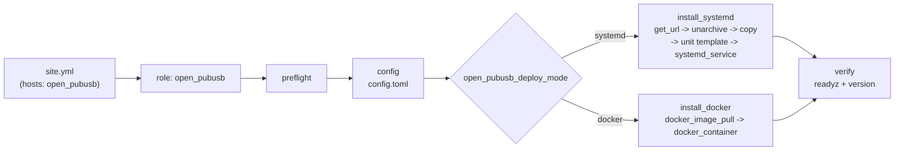

# open-pubusb Ansible Deployment

> Japanese: [README.ja.md](README.ja.md)

## Table of Contents

- [Overview](#overview)
- [Prerequisites](#prerequisites)
- [Directory Layout](#directory-layout)
- [Usage](#usage)
- [Public Variables](#public-variables)
- [Tags](#tags)
- [Idempotency and Restart Guarantees](#idempotency-and-restart-guarantees)
- [Verification (verify)](#verification-verify)
- [Role Tests (molecule)](#role-tests-molecule)
- [Note on Persistence](#note-on-persistence)

## Overview

Provides the Ansible role `open_pubusb`, which deploys `open-pubusb` (a Google Cloud Pub/Sub v1-compatible
local server) as a `systemd` service or a Docker container, along with its entry point
`site.yml`. The role's public variables and their defaults are defined in
`roles/open_pubusb/defaults/main.yml`.



## Prerequisites

| Target | Requirement |
|---|---|
| Control node | ansible-core >= 2.16 (Python >= 3.10). `ansible-galaxy collection install -r requirements.yml` has been run |
| Target host (systemd) | Linux x86_64 (the only architecture released as a tarball), systemd 245+, `become` available, HTTPS access to GitHub Releases (or a local mirror URL set in `open_pubusb_release_base_url`) |
| Target host (docker) | Linux x86_64 (the published image is single-arch `linux/amd64`), Docker Engine running, Python Docker SDK (required by `community.docker`), access to GHCR |
| Target host (localhost) | The same role also works with `ansible_connection: local` |

## Directory Layout

```text
ansible/
├── ansible.cfg
├── requirements.yml
├── site.yml
├── inventory/
│   ├── hosts.yml
│   └── host_vars/<host>/vars.yml
├── group_vars/all.yml
└── roles/open_pubusb/
    ├── defaults/main.yml
    ├── vars/main.yml
    ├── tasks/{main,preflight,config,install_systemd,install_docker,docker_container,verify}.yml
    ├── templates/{config.toml.j2,open-pubusb.service.j2}
    ├── handlers/main.yml
    ├── meta/main.yml
    └── molecule/{default,docker}/{molecule.yml,converge.yml,verify.yml} (+ docker/cleanup.yml)
```

## Usage

```bash
cd ansible
ansible-galaxy collection install -r requirements.yml
ansible-playbook -i inventory/hosts.yml site.yml -e open_pubusb_deploy_mode=systemd
ansible-playbook -i inventory/hosts.yml site.yml -e open_pubusb_deploy_mode=docker
```

Syntax check and dry run:

```bash
ansible-playbook -i inventory/hosts.yml site.yml --syntax-check
ansible-playbook -i inventory/hosts.yml site.yml --check --diff -e open_pubusb_deploy_mode=docker
```

Static analysis:

```bash
ansible-lint ansible/
yamllint ansible/
```

## Public Variables

The source of truth for all public variables (defaults and descriptions) is
`roles/open_pubusb/defaults/main.yml`. Override them in any of
`group_vars/`, `inventory/host_vars/<host>/vars.yml`, or `-e`.

## Tags

| Tag | What it does |
|---|---|
| `preflight` | Variable validation, OS/arch detection, required packages (in docker mode, checks that Docker is running) |
| `install` | Fetch and place the binary (systemd) / pull the image (docker) |
| `configure` | Generate `config.toml` and the unit file |
| `service` | Enable and start the service / create the container |
| `verify` | Wait for readyz and check the version |

```bash
ansible-playbook -i inventory/hosts.yml site.yml --tags configure -e open_pubusb_deploy_mode=systemd
```

## Idempotency and Restart Guarantees

- Second and subsequent runs report `changed=0` (as long as neither the version nor the configuration changed).
- A restart happens only when "`config.toml` or the unit file changed" or "the binary /
  image tag changed". Restarts go through `handlers` (systemd: `Restart open-pubusb`, docker:
  `Recreate open-pubusb container`).
- The Docker container passes every option explicitly to `community.docker.docker_container` and
  uses `comparisons: {image: strict, env: strict, '*': ignore}` to avoid unnecessary re-creation.
  Because `config.toml` is bind-mounted, `docker_container` itself cannot detect content changes,
  so the `Recreate open-pubusb container` handler in `handlers/main.yml` forces re-creation with `recreate: true`.
- The role never deletes the data directory (no `state: absent` cleanup task is provided).

## Verification (verify)

1. Wait with `ansible.builtin.uri` until `http://<bind>:<admin_port>/readyz` returns 200
   (up to 30 attempts at 2-second intervals).
2. `assert` that the output of `open-pubusb version` (systemd) / `docker exec <container> open-pubusb version` (docker)
   contains `open_pubusb_version`.

Set `open_pubusb_verify: false` to skip the verification tasks.

## Role Tests (molecule)

```bash
cd roles/open_pubusb
molecule test                # default scenario (systemd, geerlingguy/docker-ubuntu2404-ansible)
molecule test -s docker       # docker scenario (bind-mounts the host's Docker socket)
```

`molecule/default` exercises systemd mode and `molecule/docker` exercises docker mode (DinD socket
mount), each through converge, idempotency, and verify. In CI they run only on pushes to `main`
(PRs run only `ansible-lint` / `yamllint` / `--check --diff`).

By default both scenarios install what the role installs in production: the release tarball from
GitHub Releases and the image from GHCR. To test a build that has not been released yet, the
scenarios accept overrides through environment variables (this is what CI does, building both
artifacts from the checkout first):

| Variable | Scenario | Effect |
|---|---|---|
| `OPEN_PUBUSB_VERSION` | both | Sets `open_pubusb_version` (tarball / image tag under test) |
| `OPEN_PUBUSB_RELEASE_BASE_URL` | default | Sets `open_pubusb_release_base_url`, e.g. a local mirror laid out by `scripts/ci/stage-release-mirror.sh` and served over HTTP |
| `OPEN_PUBUSB_IMAGE` | docker | Sets `open_pubusb_image`; the image must already exist on the host daemon |

```bash
# Example: test the current checkout without a release.
docker build -t ghcr.io/siosig/open-pubusb:0.1.0 .
scripts/ci/stage-release-mirror.sh ghcr.io/siosig/open-pubusb:0.1.0 0.1.0 dist
python3 -m http.server 8000 --bind 0.0.0.0 --directory dist &
cd ansible/roles/open_pubusb
OPEN_PUBUSB_VERSION=0.1.0 OPEN_PUBUSB_RELEASE_BASE_URL=http://172.17.0.1:8000 molecule test
OPEN_PUBUSB_VERSION=0.1.0 OPEN_PUBUSB_IMAGE=ghcr.io/siosig/open-pubusb molecule test -s docker
```

`172.17.0.1` is the default Docker bridge gateway, which is how the molecule instance reaches
the host. The docker scenario runs its instance in the host network namespace and shares
`/etc/open-pubusb` and `/srv/open-pubusb` with the host, because the `open-pubusb` container the
role manages is created by the host's daemon.

## Note on Persistence

**Persistence**: With `open_pubusb_ephemeral: false` (the default), data is persisted in `open_pubusb_data_dir` using the embedded LSM store (fjall), so topics, subscriptions, and un-acked messages survive restarts. In docker mode this directory is bind-mounted at `/data` and owned by the container's runtime user (`open_pubusb_container_uid` / `_gid`, default 65532 = distroless `nonroot`). Setting it to `true` runs fully in memory on a temporary directory.
