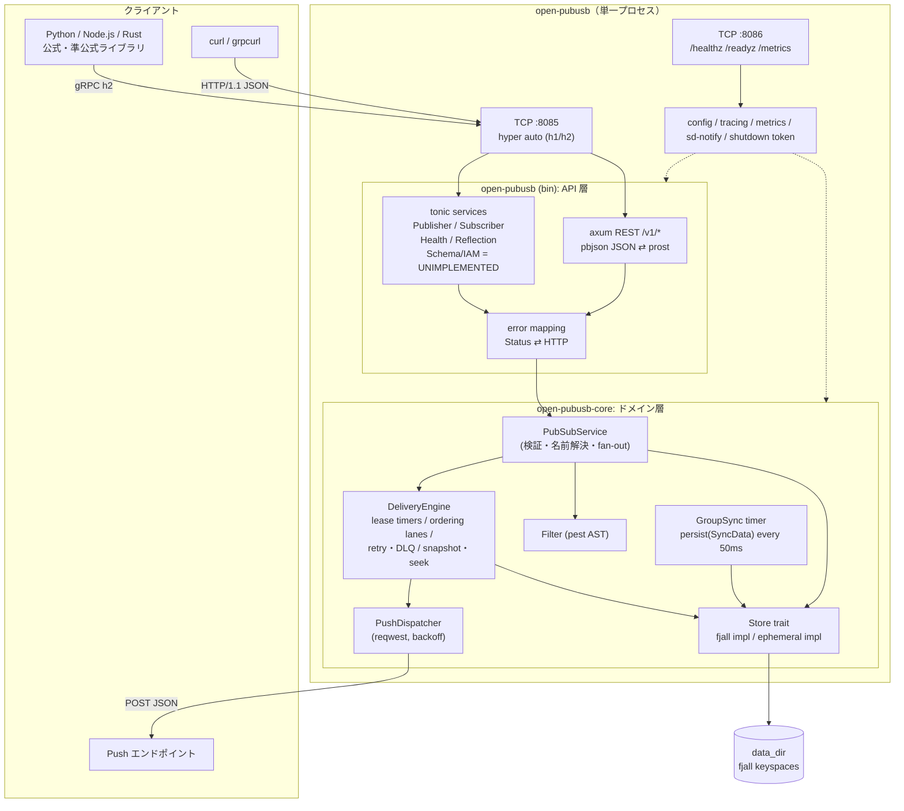
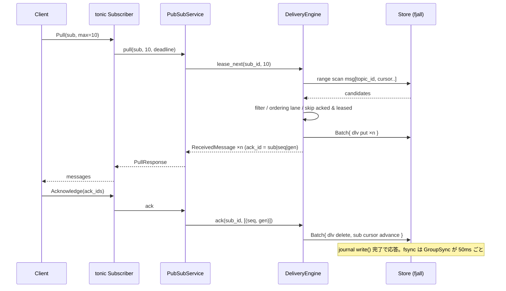

# アーキテクチャ

> English: [architecture.md](architecture.md)

## 目次

- [概要](#概要)
- [全体構成](#全体構成)
- [配信の流れ（Pull）](#配信の流れpull)
- [レイヤ構成](#レイヤ構成)
- [ストレージ設計](#ストレージ設計)
- [関連ドキュメント](#関連ドキュメント)

## 概要

`open-pubusb` は単一プロセス・単一ノードで動く GCP Pub/Sub v1 互換ブローカー。`tonic`（gRPC）と `axum`（REST）を同一 TCP ポートで多重化し、ドメインロジックを持つ `open-pubusb-core` クレートを両者から共通に呼び出す。永続化は `fjall`（pure Rust LSM ストア）のキースペース群で行い、書き込みは即座に OS バッファへ反映（`kill -9` 耐性）、fsync は 50 ms 周期のグループコミットでまとめる。

## 全体構成

## 配信の流れ（Pull）

`StreamingPull` / Push 配信も同じ `DeliveryEngine::lease_next`/`ack` を経由する（`crates/open-pubusb/src/grpc/streaming.rs` / `crates/open-pubusb-core/src/push/dispatcher.rs` がそれぞれ内部ストリームとして `open_stream`/`lease_for_stream`/`stream_acknowledge` を呼ぶ）。

## レイヤ構成

| Crate | 役割 | 外部依存 |
|---|---|---|
| `open-pubusb-proto` | `googleapis` の `.proto` から `tonic-prost-build`/`pbjson-build` で生成したコードの再エクスポート | tonic, prost, pbjson |
| `open-pubusb-core` | ドメインロジック（Topic/Subscription CRUD、配信エンジン、フィルタ、Push ディスパッチャ、ストレージ抽象）。gRPC/REST 非依存で単体テスト可能 | fjall, pest, reqwest |
| `open-pubusb`（バイナリ） | gRPC/REST API 層、CLI、設定、ログ・メトリクス・systemd 連携 | tonic, axum, tracing, metrics |
| `open-pubusb-bench` | 負荷生成・マイクロベンチマーク（`open-pubusb-core`/`open-pubusb-proto` を利用） | criterion, clap |

`open-pubusb-core` が tonic/axum に依存しない設計により、統合テスト（`tests/integration/`）は実プロセスを起動せず in-process で `PubSubService` を直接叩ける。契約テスト（`tests/contract/`）は実バイナリを起動し gRPC/REST 経由で検証する。

## ストレージ設計

`fjall` のキースペース（`meta` / `msg` / `sub` / `dlv` / `okey` / `snap`）に、ビッグエンディアン固定長キーでリソースを配置する。詳細なキー設計は `crates/open-pubusb-core/src/store/fjall.rs` のストア実装を正本とする。書き込みごとに `persist(PersistMode::Buffer)`（OS バッファ即時反映）が行われ、`GroupSync` タスクが `storage.sync_interval_ms`（既定 50 ms）ごとに `persist(PersistMode::SyncData)` でグループ fsync する。フォーマットバージョンは `meta/__open_pubusb_format_version` に書き込まれ、より新しいバージョンのデータディレクトリを古いバイナリで開こうとするとエラーで拒否する（`crates/open-pubusb-core/src/store/fjall.rs`）。

## 関連ドキュメント

- [`docs/operations.ja.md`](./operations.ja.md) — 運用ランブック（systemd/Docker、メトリクス、ログ、停止挙動、バックアップ、アップグレード）
