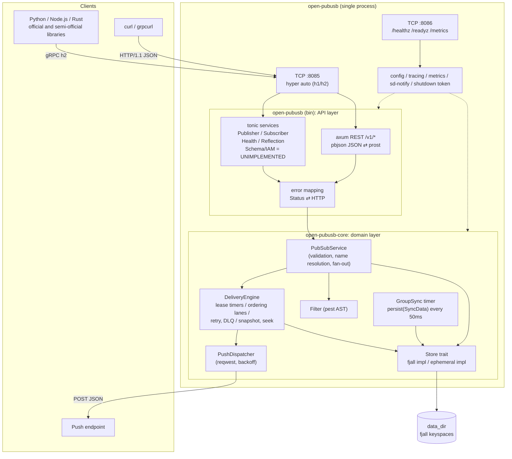

# Architecture

> Japanese: [architecture.ja.md](architecture.ja.md)

## Table of Contents

- [Overview](#overview)
- [System overview](#system-overview)
- [Delivery flow (Pull)](#delivery-flow-pull)
- [Layer structure](#layer-structure)
- [Storage design](#storage-design)
- [Related documents](#related-documents)

## Overview

`open-pubusb` is a GCP Pub/Sub v1-compatible broker that runs as a single process on a single node. `tonic` (gRPC) and `axum` (REST) are multiplexed on the same TCP port, and both call into the shared `open-pubusb-core` crate, which holds the domain logic. Persistence is handled by a set of `fjall` (pure-Rust LSM store) keyspaces: every write is flushed to the OS buffer immediately (surviving `kill -9`), while fsyncs are batched into a group commit every 50 ms.

## System overview



## Delivery flow (Pull)

```mermaid
sequenceDiagram
    participant C as Client
    participant G as tonic Subscriber
    participant S as PubSubService
    participant D as DeliveryEngine
    participant K as Store (fjall)
    C->>G: Pull(sub, max=10)
    G->>S: pull(sub, 10, deadline)
    S->>D: lease_next(sub_id, 10)
    D->>K: range scan msg[topic_id, cursor..]
    K-->>D: candidates
    D->>D: filter / ordering lane / skip acked & leased
    D->>K: Batch{ dlv put ×n }
    D-->>S: ReceivedMessage ×n (ack_id = sub|seq|gen)
    S-->>G: PullResponse
    G-->>C: messages
    C->>G: Acknowledge(ack_ids)
    G->>S: ack
    S->>D: ack(sub_id, [(seq, gen)])
    D->>K: Batch{ dlv delete, sub cursor advance }
    Note over K: Responds once the journal write() completes; GroupSync fsyncs every 50ms
```

`StreamingPull` and Push delivery go through the same `DeliveryEngine::lease_next`/`ack` (`crates/open-pubusb/src/grpc/streaming.rs` and `crates/open-pubusb-core/src/push/dispatcher.rs` each call `open_stream`/`lease_for_stream`/`stream_acknowledge` as an internal stream).

## Layer structure

| Crate | Role | External dependencies |
|---|---|---|
| `open-pubusb-proto` | Re-exports the code generated from the `googleapis` `.proto` files with `tonic-prost-build`/`pbjson-build` | tonic, prost, pbjson |
| `open-pubusb-core` | Domain logic (Topic/Subscription CRUD, delivery engine, filter, push dispatcher, storage abstraction). Independent of gRPC/REST and unit-testable on its own | fjall, pest, reqwest |
| `open-pubusb` (binary) | gRPC/REST API layer, CLI, configuration, logging, metrics, systemd integration | tonic, axum, tracing, metrics |
| `open-pubusb-bench` | Load generation and micro-benchmarks (uses `open-pubusb-core`/`open-pubusb-proto`) | criterion, clap |

Because `open-pubusb-core` does not depend on tonic/axum, the integration tests (`tests/integration/`) can drive `PubSubService` directly in-process without launching a real process. The contract tests (`tests/contract/`) launch the real binary and verify it over gRPC/REST.

## Storage design

Resources are laid out in the `fjall` keyspaces (`meta` / `msg` / `sub` / `dlv` / `okey` / `snap`) using fixed-length big-endian keys. The key layout is defined by the store implementation in `crates/open-pubusb-core/src/store/fjall.rs`. Every write performs `persist(PersistMode::Buffer)` (immediate flush to the OS buffer), and the `GroupSync` task performs a group fsync with `persist(PersistMode::SyncData)` every `storage.sync_interval_ms` (default 50 ms). The format version is written to `meta/__open_pubusb_format_version`, and opening a data directory written in a newer version with an older binary is refused with an error (`crates/open-pubusb-core/src/store/fjall.rs`).

## Related documents

- [`docs/operations.md`](./operations.md) — Operations runbook (systemd/Docker, metrics, logging, shutdown behavior, backup, upgrade)
